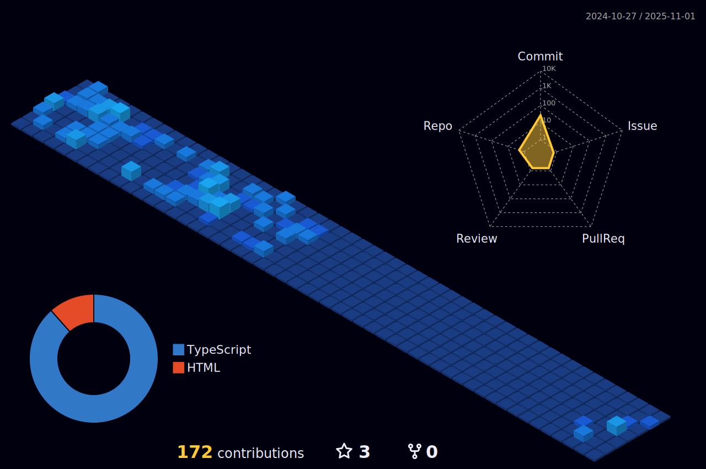

<h1 align="left">Hello World, I'm Kaique 👨🏽‍💻🏴‍☠️</h1>

Back-end Developer

##  About me

  - 👨🏽‍💻 Trabalho com Java
  - 💻 
  - 👨‍🎓 Formado em Análise e Desenvolvimento de Sistemas - UNIP(2018)
  - 📚 Cursando Pós Graduação em Arquitetura e Desenvolvimento em Java - FIAP (2023 - 2024)

## 📊 My activities

  

## Connect with me:

## Languages and Frameworks:

 
    
## Tools: 

 
 
##

    

